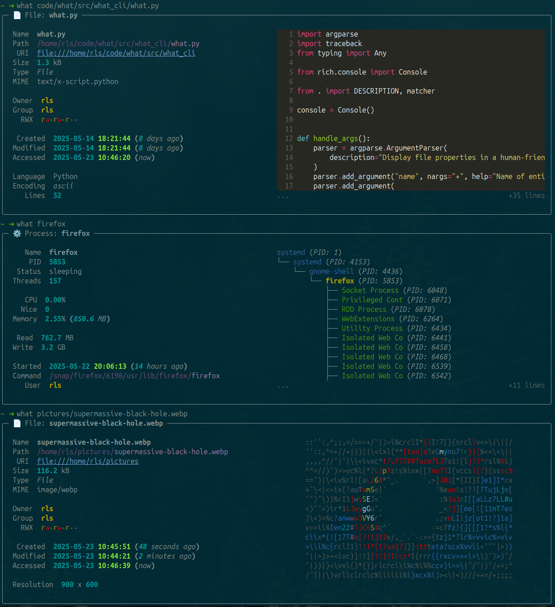

# what: Right-Click for the Command Line

Have you ever wanted to right-click on a file from the command line and get all the details about it, rather than invoke a bunch of a different utilities? `ls`, `stat` etc. are all fine, but sometimes you want all the info in one place.

What about looking up a process's details? Or a user on the system's details? Can you remember all the commands?

Meet `what`, a handy one-stop utility for looking up details about things on your system.

# Installation

`pipx install what-cli`

# Features

- Look up files, processes, and users on your system (more things to be added)
- Flexible output showing available data depending on the context (e.g. resolution is shown for image files, whereas lines and word count is displayed for text files)
- Preview pane showing something about the thing being looked up is shown if there is enough console space (e.g. process tree for processes, ascii drawing for image files)

# Screenshots

